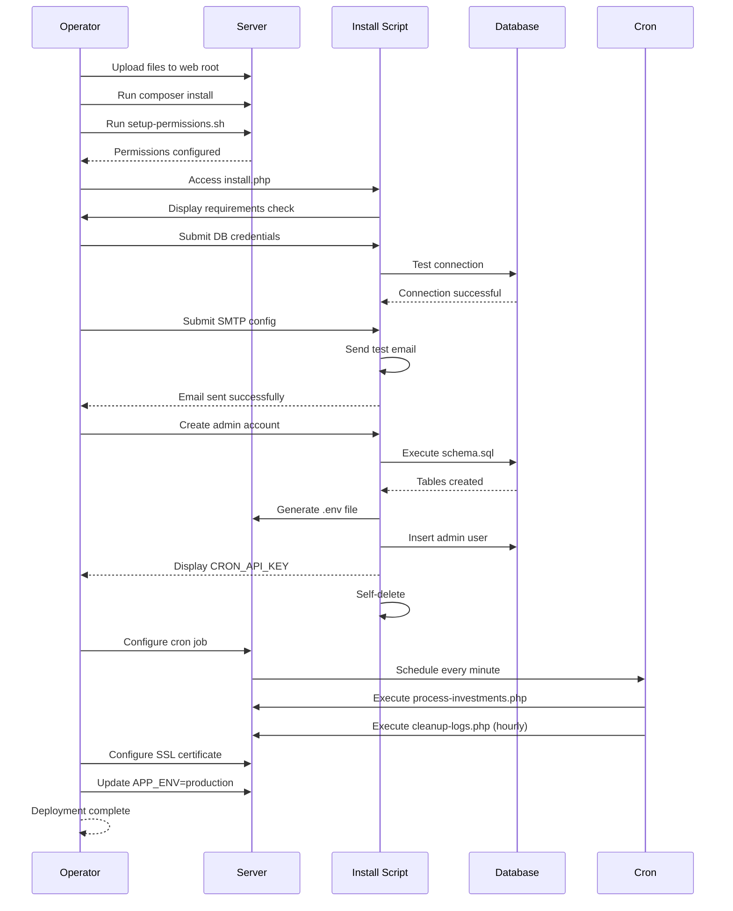
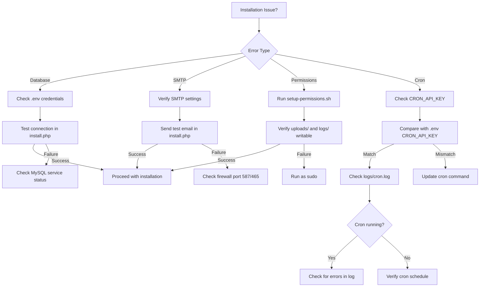

# Investment Platform - White-Label Investment Management System

Simplified platform for rapid deployment with core features (deposits, automated profits, withdrawals, referrals, multi-language)

Target audience: Entrepreneurs launching branded investment businesses

Key features:

- User registration and KYC verification
- Investment plans with automated profit calculation
- Withdrawal management system
- Referral system with commissions
- Multi-language support (Gettext)

## Server Requirements

- PHP version: 8.0 or higher
- Required PHP extensions: PDO, pdo_mysql, gettext, mbstring, fileinfo
- Database: MySQL 5.7+ or MariaDB 10.3+
- Web server: Apache 2.4+ with mod_rewrite enabled
- Dependency manager: Composer (for PHPMailer installation)
- SSL certificate: Required for production (Let's Encrypt recommended)
- Server resources: 2-4 CPU cores, 4-8GB RAM (supports 100-1,000 users)
- Cron access: System cron or HTTP-based cron service

## Installation Walkthrough

1. Upload all files to web root directory (e.g., `/var/www/public_html/` or `/var/www/html/`)
2. Navigate to project directory and run `composer install` to install PHPMailer dependency
3. Ensure proper file permissions (reference `setup-permissions.sh` script)
4. Access `https://yourdomain.com/install.php` in browser
5. Complete installation wizard steps:
    - Requirements check (PHP version, extensions, directory permissions)
    - Database configuration (host, name, user, password) with connection test
    - SMTP configuration (host, port, credentials, from address) with test email
    - Admin account creation (name, email, password)
    - Final installation execution
6. Installation script creates `.env` file, executes `database/schema.sql`, creates admin user, and self-deletes
7. Note the CRON_API_KEY displayed on success page for cron setup



## Cron Setup Instructions

### Investment Processing Cron

Purpose: Automated profit calculation and investment processing

Endpoint: `https://yourdomain.com/cron/process-investments.php?key=YOUR_CRON_API_KEY`

Frequency: Every minute (recommended)

Setup methods:

- **System Cron (Linux/Unix)**: Add to crontab using `crontab -e`: `* * * * * curl -s "https://yourdomain.com/cron/process-investments.php?key=YOUR_CRON_API_KEY" >/dev/null 2>&1`
- **cPanel Cron Jobs**: Navigate to Cron Jobs, set interval to "Every Minute", command: `curl -s "https://yourdomain.com/cron/process-investments.php?key=YOUR_CRON_API_KEY"`
- **HTTP Cron Services**: Use services like EasyCron or cron-job.org with URL and 1-minute interval

Verification: Check `logs/cron.log` for execution logs

Troubleshooting: Use admin panel "Clear Cron Lock" if stuck (found in `admin/actions/clear-cron-lock.php`)

### Log Cleanup Cron

Purpose: Automatic log file rotation to prevent directory growth

Endpoint: `https://yourdomain.com/cron/cleanup-logs.php?key=YOUR_CRON_API_KEY`

Frequency: Every hour (recommended)

Setup methods:

- **System Cron (Linux/Unix)**: Add to crontab using `crontab -e`: `0 * * * * curl -s "https://yourdomain.com/cron/cleanup-logs.php?key=YOUR_CRON_API_KEY" >/dev/null 2>&1`
- **cPanel Cron Jobs**: Navigate to Cron Jobs, set interval to "Every Hour", command: `curl -s "https://yourdomain.com/cron/cleanup-logs.php?key=YOUR_CRON_API_KEY"`
- **HTTP Cron Services**: Use services like EasyCron or cron-job.org with URL and 1-hour interval

Configuration: Set `LOG_MAX_SIZE` in `.env` (default: 10485760 bytes = 10MB)

Verification: Check `logs/cleanup.log` for cleanup operations

## HTTPS/SSL Configuration

Importance: Required for secure session cookies and password transmission

Let's Encrypt setup (Apache):

- Install Certbot: `sudo apt-get install certbot python3-certbot-apache`
- Obtain certificate: `sudo certbot --apache -d yourdomain.com -d www.yourdomain.com`
- Auto-renewal: Certbot sets up automatic renewal via systemd timer

Manual SSL certificate installation:

- Place certificate files in `/etc/ssl/certs/` and private key in `/etc/ssl/private/`
- Update Apache VirtualHost configuration to enable SSL and reference certificate paths
- Enable SSL module: `sudo a2enmod ssl`
- Restart Apache: `sudo systemctl restart apache2`

Update `.env`: Change `APP_ENV=production` to enable secure session flags

Force HTTPS: Add redirect rule to `.htaccess` (before existing rules):

```
RewriteEngine On
RewriteCond %{HTTPS} off
RewriteRule ^(.*)$ https://%{HTTP_HOST}/$1 [R=301,L]
```

## Security Checklist

| Security Feature              | Verification Method                                                | Expected Result                                 | Reference File                 |
| ----------------------------- | ------------------------------------------------------------------ | ----------------------------------------------- | ------------------------------ |
| .env file protection          | `curl https://yourdomain.com/.env`                                 | 403 Forbidden                                   | `.htaccess`                    |
| Includes directory protection | `curl https://yourdomain.com/includes/db.php`                      | 403 Forbidden                                   | `includes/.htaccess`           |
| Logs directory protection     | `curl https://yourdomain.com/logs/cron.log`                        | 403 Forbidden                                   | `logs/.htaccess`               |
| Locale directory protection   | `curl https://yourdomain.com/locale/en_US/LC_MESSAGES/messages.po` | 403 Forbidden                                   | `.htaccess`                    |
| Database directory protection | `curl https://yourdomain.com/database/schema.sql`                  | 403 Forbidden                                   | `.htaccess`                    |
| PHP execution in uploads      | Upload .php file, access directly                                  | 403 Forbidden or no execution                   | `uploads/.htaccess`            |
| CSRF token validation         | Submit form without token                                          | Error: "Invalid security token"                 | `includes/functions.php`       |
| SQL injection protection      | All queries use prepared statements                                | Code review: No string concatenation in queries | `includes/db.php`              |
| XSS protection                | All output uses `e()` function                                     | Code review: `e()` wraps user data              | `includes/functions.php`       |
| Password hashing              | Check database `users.password_hash`                               | Bcrypt hash format ($2y$...)                    | `actions/register-submit.php`  |
| Session security              | Check session cookie flags                                         | httponly, secure (production), SameSite=Lax     | `includes/session.php`         |
| Cron API key                  | Access cron without key                                            | 401 Unauthorized                                | `cron/process-investments.php` |

## Troubleshooting

### Common Errors and Solutions

- "Database connection failed": Verify credentials in `.env`, ensure MySQL service is running, check database exists
- "SMTP connection failed": Verify SMTP credentials in `.env`, test with `install.php` email test feature, check firewall allows outbound port 587/465
- "Cron not processing investments": Verify CRON_API_KEY matches `.env`, check `logs/cron.log` for errors, ensure cron job is scheduled correctly
- "File upload failed": Check directory permissions (755 for `uploads/` subdirectories), verify disk space, check `logs/upload-errors.log`
- "Session timeout too short/long": Adjust SESSION_TIMEOUT in `.env` (default 1800 seconds = 30 minutes)
- "Translations not working": Compile .po files to .mo using `msgfmt messages.po -o messages.mo` in `locale/en_US/LC_MESSAGES/` and `locale/fr_FR/LC_MESSAGES/`
- "Stale cron lock": Use admin panel "Clear Cron Lock" feature or manually delete `cron/process-investments.lock`

### Log File Locations

- Database errors: `logs/db-errors.log`
- Email errors: `logs/email-errors.log`
- Cron activity: `logs/cron.log`
- Upload errors: `logs/upload-errors.log`
- Installation logs: `logs/install.log` and `logs/install-errors.log`

### Debug Mode

Set `APP_ENV=development` in `.env` to enable detailed error messages (disable in production)



## Backup Recommendations

### Database Backup

- Frequency: Daily automated backups
- Method: `mysqldump -u DB_USER -p DB_NAME > backup_$(date +%Y%m%d).sql`
- Retention: Keep 7 daily, 4 weekly, 12 monthly backups
- Storage: Off-site storage (AWS S3, Google Cloud Storage, or separate server)

### File Backup

- Critical directories: `uploads/` (user-uploaded files), `locale/` (translations), `.env` (configuration)
- Method: `tar -czf uploads_backup_$(date +%Y%m%d).tar.gz uploads/`
- Frequency: Daily for uploads, weekly for configuration files

### Backup Automation Script (example)

```bash
#!/bin/bash
BACKUP_DIR="/backups/tradeonix"
DATE=$(date +%Y%m%d)
mysqldump -u root -p tradeonix_db > $BACKUP_DIR/db_$DATE.sql
tar -czf $BACKUP_DIR/uploads_$DATE.tar.gz /var/www/html/uploads/
find $BACKUP_DIR -name "*.sql" -mtime +7 -delete
find $BACKUP_DIR -name "*.tar.gz" -mtime +7 -delete
```

### Restoration Testing

Test backup restoration quarterly to ensure data integrity

## Deployment Best Practices

### Production Environment Variables

Detailed explanation of each `.env` variable:

- `DB_HOST`, `DB_NAME`, `DB_USER`, `DB_PASS`: Database connection credentials
- `SMTP_HOST`, `SMTP_PORT`, `SMTP_USER`, `SMTP_PASS`, `SMTP_FROM_EMAIL`, `SMTP_FROM_NAME`: Email configuration
- `CRON_API_KEY`: Security key for cron endpoint (must be 64+ characters)
- `APP_ENV`: Set to `production` for secure cookies and error suppression
- `SESSION_TIMEOUT`: Session inactivity timeout in seconds (default 1800)

Security recommendations:

- Never commit `.env` to version control (already in .gitignore)
- Use strong database passwords (16+ characters, mixed case, numbers, symbols)
- Rotate CRON_API_KEY quarterly
- Restrict database user permissions to only required operations

### Error Reporting Settings

PHP configuration for production:

- `display_errors = Off` (prevent information disclosure)
- `log_errors = On` (enable error logging)
- `error_log = /var/www/html/logs/php-errors.log` (centralized logging)

Apache configuration:

- Disable directory listing (already configured in `.htaccess`)
- Hide server signature: `ServerSignature Off`, `ServerTokens Prod` in apache2.conf

Monitor log files regularly using log rotation:

- Configure logrotate for `logs/*.log` files
- Example logrotate config: rotate daily, keep 14 days, compress old logs

### Regular Security Updates

PHP updates:

- Check current version: `php -v`
- Update via package manager: `sudo apt-get update && sudo apt-get upgrade php`
- Test application after updates in staging environment

Composer dependency updates:

- Check outdated packages: `composer outdated`
- Update PHPMailer: `composer update phpmailer/phpmailer`
- Review changelogs before updating

Security monitoring:

- Subscribe to PHP security mailing list
- Monitor PHPMailer GitHub security advisories
- Review `.htaccess` rules quarterly for new attack vectors

Application updates:

- Review `database/migrations-settings.sql` for schema changes
- Test updates in staging environment before production deployment
- Backup database before applying updates

### Performance Optimization

PHP OPcache configuration:

- Enable in php.ini: `opcache.enable=1`
- Set memory: `opcache.memory_consumption=128`
- Validate timestamps in development: `opcache.validate_timestamps=1`
- Disable timestamp validation in production: `opcache.validate_timestamps=0` (requires manual cache clear after code changes)

MySQL optimization:

- Enable query cache: `query_cache_type=1`, `query_cache_size=64M`
- Optimize connection pooling: `max_connections=100`
- Index verification: Ensure indexes exist on `database/schema.sql` foreign keys and frequently queried columns

Cron job optimization:

- Monitor execution time in `logs/cron.log`
- If exceeding 30 seconds, reduce batch size (LIMIT 100 in `cron/process-investments.php` line 240)
- Consider increasing cron interval to 5 minutes if processing load is low

File upload optimization:

- Set max upload size in php.ini: `upload_max_filesize=10M`, `post_max_size=10M`
- Implement image compression for proof uploads (future enhancement)

### Monitoring and Alerts

Log monitoring setup:

- Use tools like Logwatch or GoAccess for automated log analysis
- Set up email alerts for critical errors in `logs/db-errors.log`
- Monitor `logs/email-errors.log` for SMTP failures

Disk space monitoring:

- Monitor `uploads/` directory growth: `du -sh uploads/`
- Set up alerts when disk usage exceeds 80%
- Implement automated cleanup of old proof files (retention policy)

Cron job monitoring:

- Verify cron execution: Check `logs/cron.log` for regular timestamps
- Alert on gaps exceeding 5 minutes (indicates cron failure)
- Monitor error rate in cron summary logs

Application health checks:

- Create simple health check endpoint: `health.php` (returns JSON with database connection status, disk space, cron last run time)
- Use uptime monitoring services (UptimeRobot, Pingdom) to monitor health endpoint
- Set up alerts for downtime exceeding 2 minutes

## Quick Start Summary

1. Upload files and run `composer install`
2. Run `setup-permissions.sh` to set correct permissions
3. Access `install.php` and complete wizard
4. Configure cron job with displayed CRON_API_KEY
5. Set up SSL certificate and force HTTPS
6. Update `APP_ENV=production` in `.env`
7. Delete `install.php` if not auto-deleted
8. Access admin panel at `https://yourdomain.com/admin/dashboard.php`
9. Configure site settings (name, logo, fees, KYC requirements)
10. Create investment plans and test user registration flow

## Additional Resources

- Technical architecture details: `AGENTS.md`
- Cron testing procedures: `tests/cron-validation/README.md`
- Database structure: `database/schema.sql`
- Configuration template: `.env.example`
